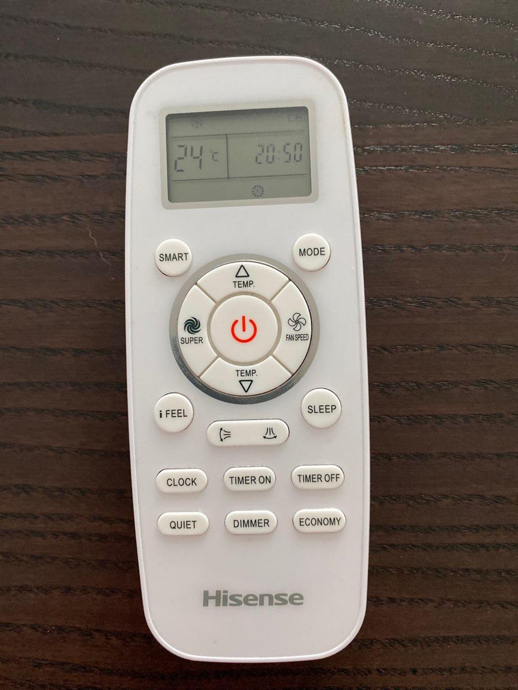

# smartIR_hisense_air
It's a set of codes for Hisense conditioner with Look.IN for https://github.com/smartHomeHub/SmartIR

* For cool and heat everything is very clear.
* For fan - all temperarures have the same code, but it differs for fan levels. Auto level is the same as max.
* For dry - all fan levels are the same, but temperatures 16-30 are equal to levels -7 - +7

